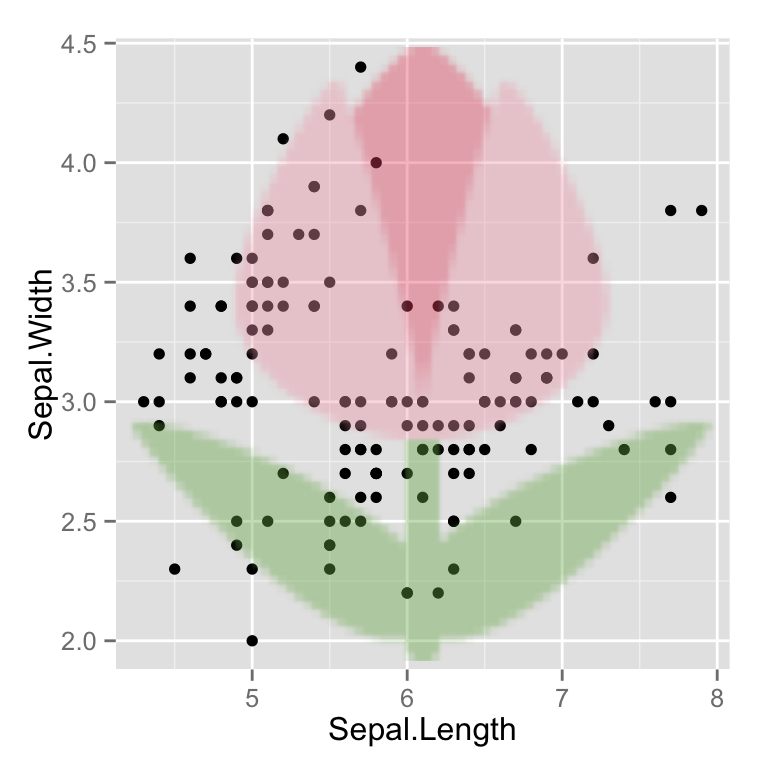

---
---

<!-- README.md is generated from README.Rmd. Please edit that file -->


# emoGG(plot)

Use emoji in your `ggplot2` plots.

This is silly.

## Installation

```r
devtools::install_github("dill/emoGG")
```

## Usage


```r
library(ggplot2)
#> Loading required package: methods
library(emoGG)
```

First need to find an emoji, using the `emoji_search` function. First look for a tulip:


```r
emoji_search("tulip")
#>          emoji       code keyword
#> 626      tulip \U0001f337 flowers
#> 627      tulip \U0001f337   plant
#> 628      tulip \U0001f337  nature
#> 629      tulip \U0001f337  summer
#> 630      tulip \U0001f337  spring
#> 3051 copyright           ©️      ip
```

The `iris` example with **real** irises (well, tulips...)


```r
ggplot(iris, aes(Sepal.Length, Sepal.Width, color = Species)) +
  geom_emoji(emoji="1f337")
```

 

What about plotting `mtcars` with **real** cars?


```r
ggplot(mtcars, aes(wt, mpg))+ geom_emoji(emoji="1f697")
```

 

Some random cats?


```r
posx <- runif(50, 0, 10)
posy <- runif(50, 0, 10)
ggplot(data.frame(x = posx, y = posy), aes(x, y)) + geom_emoji(emoji="1f63b")
```

 

We can also just put a big emoji in the background:


```r
qplot(x=Sepal.Length, y=Sepal.Width, data=iris, geom="point") + add_emoji(emoji="1f337")
```

 

## Acknowledgements

Emoji lookup is from @muan's [`emojilib`](https://github.com/muan/emojilib).

Emoji are loaded from a CDN using Twitter's [`twemoji`](https://github.com/twitter/twemoji), which is [CC-BY 4.0](https://creativecommons.org/licenses/by/4.0/) licensed. You can get attribution details [on the project page](https://github.com/twitter/twemoji#attribution-requirements).

With apologies, DLM.
